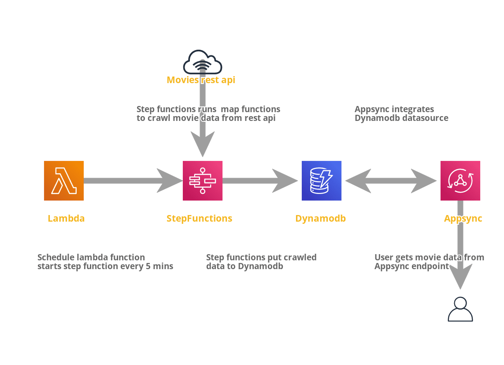
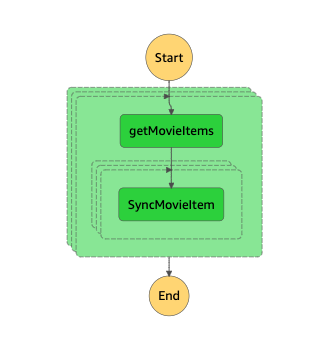
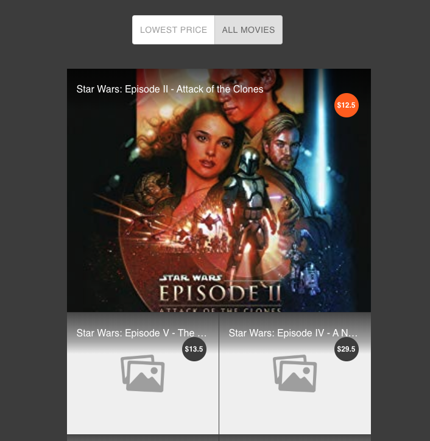

# Introduction

Build a web app to allow customers to get the cheapest price for movies from two movies data providers in a timely manner.

Design a solution to have a functioning app when not all of the providers are functioning at 100 %.

# Solution

This solution includes Appsync backend `backend/` and react frontend `fontend/`.

## Backend

As mentioned above that not all of the providers are functioning at 100 %, thus I designed a crawl pipeline to crawl data from external provider api every ? minutes and save the crawled data to DynamoDB table. The DynamoDB table integrated to Appsync api as a data source.

In this way users can get movie data from Appsync graphql api instead of external api.

# Overview of the Pipeline

- Schedule a lambda function starts AWS state machine every ? minutes.
- State machine starts step functions and dynamically crawling movies meta data with map states (data provider name).
- After movies meta data crawled, State machine starts next batch of step functions to dynamically crawl movie details data by movie id. then save the movie details data to DynamoDB table.
- Appsync api integrates to DynamoDB table, User gets movie data by requesting Appsync graphql api endpoint.

Note: Since external rest api is not working properly all the time. I added `Retry` to each of the step functions, if crawl job function fun failed, the function would rerun by given `Retry` times automatically.



### Step functions visual workflow <br>



## Prerequisites

The following must be done before following this guide:

- Setup an AWS account.
- Configure the AWS CLI with user credentials.
- Install AWS CLI.
- Install Serverless Framework.

## Install Serverless Framework

Before getting started, Install the Serverless Framework. Open up a terminal and type `npm install -g serverless` to install Serverless framework.

then, go to project root level, run `npm install`.

## Deploy

Once you deploy your service, the value of those API keys will be auto generated by AWS and printed on the screen for you to use. The values can be concealed from the output with the --conceal deploy option.

```
sls deploy --stage dev --region YOUR-REGION --aws-profile YOUR-PROFILE
```

## Unit test

```
npm test
```

# Frontend

Frontend is a simple react website to get movie with cheapest price or all movies sorted by price.



## Available Scripts

In the project directory, you can run:

### `npm start`

Runs the app in the development mode.<br />
Open [http://localhost:3000](http://localhost:3000) to view it in the browser.

The page will reload if you make edits.<br />
You will also see any lint errors in the console.

### `npm test`

Launches the test runner in the interactive watch mode.<br />
See the section about [running tests](https://facebook.github.io/create-react-app/docs/running-tests) for more information.

### `npm run build`

Builds the app for production to the `build` folder.<br />
It correctly bundles React in production mode and optimizes the build for the best performance.

The build is minified and the filenames include the hashes.<br />
Your app is ready to be deployed!
